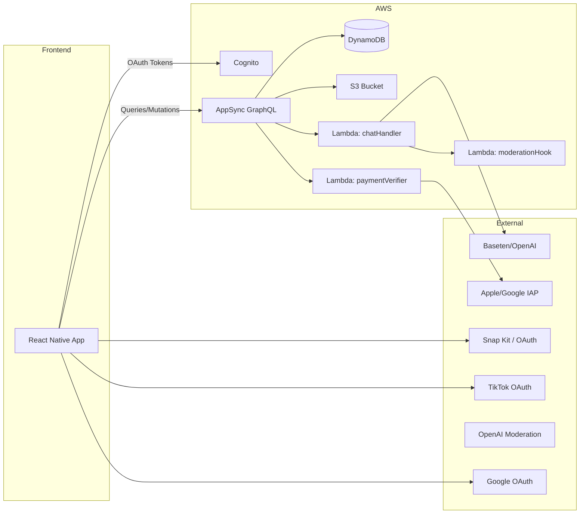

# HNNT Application Architecture

*Aggregates project structure, dependencies, and wiring for the MVP.  Serves as a single reference for all collaborators.*
*Last updated: 2025-05-22*

---

## Table of Contents

1. [High-Level Overview](#high-level-overview)
2. [Monorepo File Structure](#monorepo-file-structure)
3. [Front-End App Structure](#front-end-app-structure)
4. [Backend & Services Structure](#backend--services-structure)
5. [GraphQL API & Data Flow](#graphql-api--data-flow)
6. [Authentication & Authorization](#authentication--authorization)
7. [Shared Configuration & Utilities](#shared-configuration--utilities)
8. [CI/CD & Deployment](#ci-cd--deployment)
9. [Environment & Secrets](#environment--secrets)

---

## 1. High-Level Overview



**Description:** Users interact with the React Native app, which authenticates via Cognito (federated with Snapchat, TikTok, Google). All data flows through a single AppSync GraphQL API (queries, mutations, subscriptions). Data is persisted in DynamoDB; media and generated share assets reside in S3. Serverless Lambdas handle AI chat proxying (with Baseten/OpenAI) and content moderation, as well as IAP verification.

---

## 2. Monorepo File Structure

```
/ (repo root)
│  .gitignore
│  .eslintrc.js          # ESLint configuration
│  .prettierrc           # Prettier configuration
│  .eslintignore         # ESLint ignore patterns
│  .husky/               # Git hooks configuration
│  README.md
│  package.json          # Root package.json for workspace management
│  package-lock.json     # Lock file for dependencies
│  tsconfig.json         # Root TS config
│  app.json             # Expo app configuration
│  eas.json             # Expo Application Services config
│  index.ts             # Root entry point
│  App.tsx              # Root App component
│
├─ apps/
│   └─ hnnt-app/        # React Native application
│      ├─ src/          # Application source code
│      │   ├─ assets/      # Images, fonts
│      │   ├─ components/  # UI components
│      │   ├─ hooks/       # Custom React hooks
│      │   ├─ navigation/  # React Navigation stacks
│      │   ├─ screens/     # Screen-level components
│      │   ├─ graphql/     # queries.ts, mutations.ts, subscriptions.ts
│      │   ├─ context/     # React Context API
│      │   ├─ styles/      # Global styles, themes
│      │   ├─ utils/       # formatters, helpers
│      │   └─ AppConfig.ts # environment variables import
│      ├─ babel.config.js
│      ├─ package.json  # RN-specific deps & scripts
│      └─ [other RN config files]
│
├─ amplify/             # Amplify-managed backend
│   ├─ backend/         # Backend resources
│   │   ├─ api/        # GraphQL API configuration
│   │   ├─ auth/       # Cognito configuration
│   │   ├─ function/   # Lambda functions
│   │   └─ storage/    # S3 and DynamoDB configuration
│   ├─ #current-cloud-backend/
│   ├─ team-provider-info.json  # Environment configurations
│   ├─ cli.json         # Amplify CLI configuration
│   └─ .config/         # Amplify internal config
│
├─ lambda/             # Supporting files for Amplify-managed Lambda functions
│   ├─ templates/      # CloudFormation templates
│   └─ scripts/        # Deployment and testing scripts
│
├─ docs/               # Project documentation
│
├─ assets/            # Global assets (images, fonts)
│
├─ web-build/         # Web version of the application
│   ├─ public/        # Static assets
│   └─ dist/          # Production build output
│
└─ .expo/             # Expo development files
```

## 2.1 Development Tools & Configuration

### Code Quality
- **ESLint**: Configured via `.eslintrc.js` for TypeScript and React Native
- **Prettier**: Code formatting rules in `.prettierrc`
- **TypeScript**: Strict type checking enabled in `tsconfig.json`

### Git Workflow
- **Husky**: Git hooks for pre-commit checks
  - Linting
  - Type checking
  - [Other pre-commit checks]

### Build & Deployment
- **Expo**: Mobile app development platform
  - Configuration in `app.json`
  - EAS (Expo Application Services) in `eas.json`
  - Development builds via `.expo/`

### Monitoring & Error Tracking
- **Sentry**: Error tracking and performance monitoring
  - Integrated for both frontend and backend
  - Automatic error reporting

## 2.2 Web Build Process

The application supports both native mobile (iOS/Android) and web platforms. The web build process differs from the native build in several ways:

### Web-Specific Considerations
- **Build Output**: Generated in `web-build/` directory
- **Platform Detection**: Conditional rendering for web vs native components
- **Asset Handling**: Web-specific optimizations for images and fonts
- **Routing**: Web-specific navigation using React Router
- **Responsive Design**: Additional styles for desktop and tablet views

### Build Process
1. **Development**:
   - `expo start --web` for local development
   - Hot reloading and web-specific debugging tools
2. **Production**:
   - `expo build:web` generates optimized production build
   - Output includes static assets and server-side rendering configuration
3. **Deployment**:
   - Web build can be deployed to any static hosting service
   - Environment-specific configurations in `app.json`

### Platform-Specific Code
- Use platform-specific extensions (`.web.tsx`, `.native.tsx`)
- Shared business logic in platform-agnostic files
- Web-specific components in `apps/hnnt-app/src/components/web/`

---

## 3. Front-End App Structure

Aligned with the Front-End MVP Guide.

```
apps/hnnt-app/src/
│
├─ AppConfig.ts        # Loads env via react-native-config or similar
│
├─ navigation/
│   ├─ AuthNavigator.tsx
│   ├─ MainNavigator.tsx
│   └─ ModalNavigator.tsx
│
├─ screens/
│   ├─ LoginScreen.tsx
│   ├─ AgeGateScreen.tsx
│   ├─ HomeScreen.tsx
│   ├─ DetailScreen.tsx
│   ├─ AddSituationshipModal.tsx
│   ├─ InviteModal.tsx
│   ├─ VoteScreen.tsx
│   ├─ ResultsScreen.tsx
│   ├─ SharePreviewModal.tsx
│   └─ SettingsScreen.tsx
│
├─ components/
│   ├─ SituationshipCard.tsx
│   ├─ RankingList.tsx
│   ├─ ChatBubble.tsx
│   ├─ ChatInputBar.tsx
│   ├─ VoteOptionCard.tsx
│   ├─ ResultBar.tsx
│   ├─ ShareTemplate.tsx
│   └─ ...other UI pieces
│
├─ hooks/
│   ├─ useAuth.ts
│   ├─ useSituationships.ts
│   ├─ useAiChat.ts
│   ├─ useInvite.ts
│   └─ useVoting.ts
│
├─ graphql/
│   ├─ queries.ts
│   ├─ mutations.ts
│   └─ subscriptions.ts
│
├─ context/            # React Context API
│
├─ styles/             # Global styles, themes, NativeWind setup
│   ├─ colors.ts
│   └─ fonts.ts
│
└─ utils/
    ├─ formatDate.ts
    └─ imageExport.ts
```

**Key Wiring:**

* **Apollo Client** (in `App.tsx`): configured with Cognito JWT, HTTP & WS links to AppSync.
* **ThemeContext**: wraps `NavigationContainer` to provide color scheme & Tailwind theme.
* **NativeWind**: utility classes in JSX for styling.
* **Framer Motion (moti)** & **Reanimated 3**: for animations in `RankingList` and `VoteOptionCard`.

---

## 4. Backend & Services Structure

Based on Backend MVP Guide and Amplify CLI structure.

```
amplify/                  # Root of Amplify-managed backend
│
├─ backend/              # Main backend resources directory
│   ├─ api/             # GraphQL API configuration
│   │   └─ HITNO/       # Our API name
│   │       ├─ schema.graphql     # Data models and @auth rules
│   │       ├─ resolvers/         # Custom VTL resolvers if needed
│   │       └─ parameters.json    # API configuration including S3
│   │
│   ├─ auth/            # Cognito configuration
│   │   └─ HITNOauth/   # User pool and identity pool settings
│   │
│   ├─ function/        # Lambda functions
│   │   ├─ chatHandler/
│   │   │   ├─ src/
│   │   │   │   └─ index.js      # AI request/response logic
│   │   │   └─ package.json
│   │   ├─ moderationHook/
│   │   │   └─ src/index.js      # OpenAI moderation check
│   │   ├─ paymentVerifier/
│   │   │   └─ src/index.js      # IAP receipt validation
│   │   ├─ PostConfirmation/     # Auth workflow function
│   │   ├─ PreSignup/            # Auth workflow function
│   │   └─ PreTokenGeneration/   # Auth workflow function
│   │
│   ├─ storage/         # S3 and DynamoDB configuration
│   │   └─ HITNOmedia  # S3 bucket for media assets
│   │
│   └─ custom/          # Custom resources if needed
│
├─ graphql/
│   ├─ schema.graphql
│   └─ resolvers/      # overrides (VTL templates)
│
├─ functions/
│   ├─ chatHandler/
│   │   ├─ src/index.js  # AI request/response logic
│   │   └─ package.json
│   ├─ moderationHook/
│   │   └─ src/index.js  # OpenAI moderation check
│   └─ paymentVerifier/
│       └─ src/index.js  # IAP receipt validation
│
├─ iam-policies/
│   └─ custom-iam-policies.json
│
├─ cfn-templates/
│   └─ overrides.json   # CloudFormation overrides if needed
│
├─ scripts/
│   └─ deploy.sh        # CI/CD helper for amplify push
│
└─ README.md           # How to set up backend locally
```

**Key Wiring:**

* **GraphQL Schema** (`schema.graphql`): defines models and @auth rules.  Use `amplify codegen models` to sync with front end.
* **AppSync Resolvers:** auto-generated for @model; custom pipeline for Chat and IAP verification.
* **Lambdas:** connected via @function directive in schema or via pipeline resolvers.
* **DynamoDB:** single-table design with PK/SK per model; TTL on InviteToken.
* **S3:** bucket declared in `amplify/backend/api/<api>/parameters.json` for shareable assets.  Access via signed URLs in GraphQL.

---

## 5. GraphQL API & Data Flow

* **Client → AppSync**: Queries, Mutations, Subscriptions via Apollo.
* **Resolvers**:

  * **@model**: CRUD on DynamoDB.
  * **Custom Mutation** for AI chat: triggers `chatHandler` Lambda.
  * **Custom Mutation** for `verifyPurchase`: triggers `paymentVerifier` Lambda.
* **Subscriptions**:

  * `onCreateVote(targetUserId: ID!)`: used by ResultsScreen for real-time updates.
  * `onUpdateSituationship(owner: ID!)`: user's list changes push to HomeScreen.

---

## 6. Authentication & Authorization

* **Cognito User Pool**: federated IdP: Snapchat (via OIDC), TikTok (OIDC), Google.
* **AWS Amplify Auth**: stores tokens, refresh flows.
* **AppSync @auth rules**:

  * **owner**: users can only modify their own data (Situationships, votes they cast, invite tokens).
  * **private**: Reports only accessible by IAM (admin).
  * **groups**: for shared content (situations shared with specific friend userIds).

---

## 7. Shared Configuration & Utilities

* **Environment Variables** (FE & BE):

  * `AMPLIFY_APP_ID`
  * `APPSYNC_API_URL`
  * `APPSYNC_REGION`
  * `COGNITO_USER_POOL_ID`
  * `COGNITO_APP_CLIENT_ID`
  * `CHAT_LAMBDA_ARN`
  * `PAYMENT_LAMBDA_ARN`
  * `SNAP_CLIENT_ID` / `TIKTOK_CLIENT_ID` / `GOOGLE_CLIENT_ID`
* **./scripts/deploy.sh**: used by GitHub Actions to `cd backend && amplify push` and `cd apps/hnnt-app && expo publish`.
* **Shared Code**: minimal; front end and back end share GraphQL schema via codegen. Ensure `amplify codegen` runs in CI after push.

---

## 8. CI/CD & Deployment

* **Front End**: 
  - GitHub Actions workflow
  - EAS Build for iOS/Android
  - Web build via `expo build:web`
  - Automated deployments:
    - Mobile: TestFlight/Play Store
    - Web: [TODO: Specify web hosting service]
  - Sentry integration for error tracking
* **Back End**: 
  - GitHub Actions → `npm test` in functions
  - `amplify push --yes` for infrastructure
  - CloudFormation stack updates
* **Quality Gates**:
  - ESLint/Prettier checks
  - TypeScript compilation
  - Husky pre-commit hooks
  - Platform-specific tests (web/native)
* **Monitoring**: 
  - CloudWatch Alarms on Lambda errors
  - Sentry for front-end exceptions (web & native)
  - Amplitude health dashboards
  - Web-specific analytics

---

## 9. Environment & Secrets

* **Local**: use `.env.local` (not checked in).  Front end uses `react-native-config`; back end Lambdas get secrets via Amplify parameter store or Secrets Manager.
* **Staging / Prod**: defined in `amplify/team-provider-info.json`.  Leverage IAM roles with restricted access.

---

**Next Steps:**

* Confirm Amplify App ID and environment names.
* Ensure all developers run `amplify pull` and `yarn install` in both `apps/hnnt-app` and `backend`.
* Review this doc in kickoff meeting to align on wiring and responsibilities.
