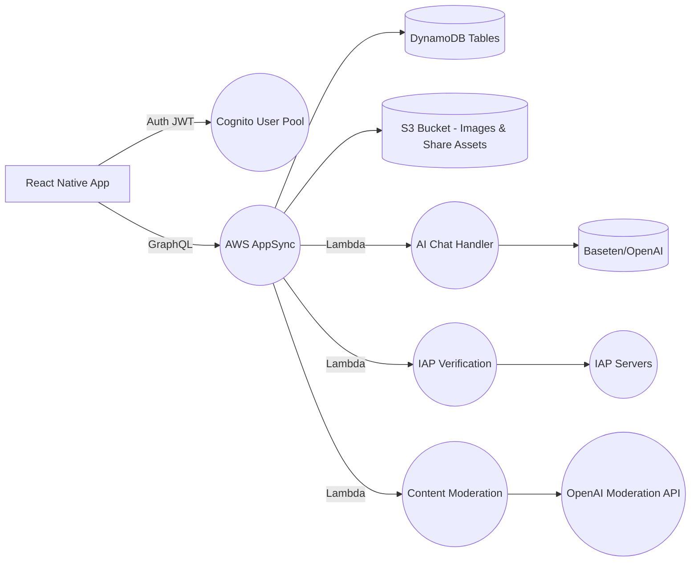

# HNNT / HINTO – Backend MVP Guide

*Companion to the PRD (v2025-05-12).  Audience: Serverless backend engineers.*
*Last updated: 2025-05-21*

---

## 1  Core Principles

1. **Serverless-first** – leverage AWS managed services (Amplify/AppSync, DynamoDB, Lambda).
2. **Security & Privacy** – JWT auth via Cognito; fine-grained GraphQL @auth rules; minimal PII.
3. **Scalability & Low-latency** – DynamoDB single-table patterns; GraphQL subscriptions for real-time.
4. **Maintainability** – IaC via Amplify CLI; clear folder layout; atomic CloudFormation resources.

---

## 2  Architecture Overview



*Data flows: client ↔ GraphQL API ↔ datastore/functions ↔ external services.*

---

## 3  AWS Resources & Services

| Resource                         | Purpose                                                   |
| -------------------------------- | --------------------------------------------------------- |
| **Cognito User Pool**            | OAuth federation: Snapchat, TikTok, Google; JWT issuance. |
| **AppSync GraphQL API**          | Single endpoint for queries, mutations, subscriptions.    |
| **DynamoDB**                     | Stores Users, Situationships, Votes, Reports.             |
| **S3 Bucket**                    | Stores shareable PNGs & optional avatar images (via PC).  |
| **Lambda Functions**             | AI Chat proxy, Payment verification, Content moderation.  |
| **CloudWatch Logs**              | Lambda & AppSync resolver logs; metrics & alarms.         |
| **IAM Roles & Policies**         | Least-privilege access for functions, AppSync, S3.        |
| **Amplify CLI / CloudFormation** | IaC definitions for all above.                            |

---

## 4  Directory & File Structure

```
backend/
  amplify/
    # auto-generated by Amplify CLI
  graphql/
    schema.graphql           # Defines types, queries, mutations, subscriptions
    resolvers/               # Custom VTL or pipeline resolvers if needed
  functions/
    chatHandler/
      src/index.js           # Lambda to proxy AI chat
      package.json
      event.json             # sample event for testing
    paymentVerifier/
      src/index.js           # Lambda to verify IAP receipts
      package.json
    moderationHook/
      src/index.js           # Lambda to call OpenAI Moderation API
      package.json
  iam-policies/              # Custom IAM policy JSONs if required
  cfn-templates/             # Additional CloudFormation snippets
  scripts/
    deploy.sh                # CI deploy helper
  README.md                  # Backend setup & amplify commands
```

---

## 5  GraphQL Schema (schema.graphql)

```graphql
# Auth directives enforce owner-based and group-based access
# See @auth in AWS Amplify docs
# Models:
#   User, Situationship, Vote, FeedbackComment, Invite, Report

type User @model @auth(rules: [
  { allow: owner },
  { allow: private, provider: iam }
]) {
  id: ID!
  username: String!
  avatarUrl: String
  isPrivate: Boolean!
  mutualsOnly: Boolean!
  plan: SubscriptionPlan
  createdAt: AWSDateTime!
}

enum SubscriptionPlan { FREE PRO }

type Situationship @model @auth(rules: [
  { allow: owner },
  { allow: groups, groupsField: "sharedWith", operations: [read] }
]) {
  id: ID!
  owner: String!                # Cognito userId
  name: String!
  emoji: String
  category: String
  rankIndex: Int
  sharedWith: [String]          # friend userIds
  createdAt: AWSDateTime!
}

type Vote @model @auth(rules: [
  { allow: owner, ownerField: "voterId", operations: [create] },
  { allow: owner, ownerField: "targetUserId", operations: [read] }
]) {
  id: ID!
  voterId: String!
  targetUserId: String!
  bestId: ID!
  worstId: ID!
  comment: String
  createdAt: AWSDateTime!
}

type Report @model @auth(rules: [
  { allow: private, provider: iam }
]) {
  id: ID!
  reporter: String
  contentId: ID!
  reason: String!
  createdAt: AWSDateTime!
}

type InviteToken @model @auth(rules: [
  { allow: owner, ownerField: "ownerId" }
]) {
  id: ID!
  ownerId: String!
  token: String!
  expiresAt: AWSDateTime!
}

# Queries & Mutations autogenerated by @model
# Subscriptions: onCreateVote, onUpdateSituationship, etc.
```

*Use Amplify CLI `amplify add api` to push this schema.*

---

## 6  API Operations & Auth Rules

| Operation             | Type         | Input / Output    | Auth               |
| --------------------- | ------------ | ----------------- | ------------------ |
| `getUser(id)`         | Query        | `User`            | owner              |
| `listUsers`           | Query        | `[User]`          | IAM (admin)        |
| `createSituationship` | Mutation     | `Situationship`   | owner              |
| `updateSituationship` | Mutation     | `Situationship`   | owner              |
| `deleteSituationship` | Mutation     | `Situationship`   | owner              |
| `listSituationships`  | Query        | `[Situationship]` | owner              |
| `generateInviteToken` | Mutation     | `InviteToken`     | owner              |
| `createVote`          | Mutation     | `Vote`            | ANY authenticated  |
| `listVotesByTarget`   | Query        | `[Vote]`          | targetUserId owner |
| `onCreateVote`        | Subscription | `Vote`            | targetUserId owner |
| `createReport`        | Mutation     | `Report`          | authenticated      |
| `listReports`         | Query        | `[Report]`        | IAM (admin)        |

*Note: Amplify automatically generates resolvers for @model types; customize via `amplify override api` if needed.*

---

## 7  Lambda Functions & Implementation

### 7.1  chatHandler (AI Proxy)

* **Trigger:** AppSync Resolver (function pipeline after user sends AI message).
* **Handler logic:**

  1. Extract `situationshipId`, `message` from event.
  2. Retrieve context summary if stored (optional future).
  3. Call Baseten/OpenAI endpoint with system + user prompt.
  4. Validate response via moderationHook invocation (async or sync).
  5. Return `chatResponse` text.
* **Env vars:** `API_KEY`, `MODEL_NAME`, `MODERATION_LAMBDA_ARN`.
* **Timeout:** 20s; **Memory:** 512MB.

### 7.2  moderationHook (Content Filter)

* **Trigger:** Lambda invoked by chatHandler or as pre-resolver mapping template.
* **Handler logic:**

  1. Receive text payload.
  2. Call OpenAI Moderation API.
  3. If flagged, throw error with code `Moderation.Library`, else return pass.
* **Env vars:** `OPENAI_API_KEY`.
* **Timeout:** 5s.

### 7.3  paymentVerifier (IAP Receipt)

* **Trigger:** AppSync Mutation `verifyPurchase`.
* **Handler logic:**

  1. Accept `receiptData`, `platform`.
  2. Call Apple/Google receipt verification endpoint.
  3. On success, update User.plan attribute in DynamoDB via AppSync mutation.
  4. Return subscription status.
* **Env vars:** `APPLE_SHARED_SECRET`, `GOOGLE_SERVICE_ACCOUNT`.
* **Timeout:** 15s.

### 7.4  snapAuthHandler (Custom OAuth Flow)

* **Trigger:** API Gateway endpoints (`/auth/snap/init` and `/auth/snap/callback`).
* **Purpose:** Custom OAuth implementation for Snapchat login, bypassing Cognito's built-in OAuth.
* **Handler logic:**

  1. **Init Flow** (`/auth/snap/init`):
     - Generate secure state parameter
     - Construct Snap OAuth URL with client ID and scopes
     - Redirect user to Snap authorization page
  2. **Callback Flow** (`/auth/snap/callback`):
     - Validate state parameter
     - Exchange code for access token via Snap API
     - Fetch user info from Snap
     - Create/update Cognito user with Snap attributes
     - Return JWT tokens for app authentication
* **Env vars:** `USER_POOL_ID` (Cognito User Pool ID).
* **Secrets:** Snap credentials stored in SSM Parameter Store (`/hinto/snap/*`).
* **Timeout:** 30s; **Memory:** 256MB.
* **IAM Role:** `HITNOauthSnapAuth-dev-role` with:
  - Cognito access (user management)
  - SSM Parameter Store access
  - CloudWatch Logs
* **Note:** This custom implementation was chosen over Cognito's built-in OAuth to:
  1. Support Snap's specific OAuth requirements
  2. Enable custom user attribute mapping
  3. Provide more control over the authentication flow
  4. Allow for future Snap-specific features (e.g., Creative Kit integration)

---

## 8  Data Modeling & Indexes

| Table            | PK                            | SK / GSI                     | Notes                          |
| ---------------- | ----------------------------- | ---------------------------- | ------------------------------ |
| `User-{userId}`  | PK = `USER#${userId}`         |                              | Single item per user           |
| `Situationships` | PK = `USER#${owner}`          | GSI1: `CATEGORY#${category}` | GSI1 fetches by tag/category   |
|                  | SK = `SITU#${id}`             |                              | Sort by creation               |
| `Votes`          | PK = `TARGET#${targetUserId}` | GSI1: `VOTER#${voterId}`     | Query votes by voter if needed |
|                  | SK = `VOTE#${id}`             |                              |                                |
| `InviteTokens`   | PK = `USER#${ownerId}`        |                              | Expire via TTL attribute       |
| `Reports`        | PK = `REPORT#${id}`           |                              | Admin-only access              |

*Use DynamoDB TTL for InviteToken.expiration and optional stale data.*

---

## 9  Infrastructure as Code (Amplify)

1. **Initialize**: `amplify init --appId <AMPLIFY_APP_ID> --env prod`
2. **Add API**: `amplify add api` → GraphQL → provide `schema.graphql`
3. **Add Functions**: `amplify add function` for each Lambda (chatHandler, paymentVerifier, moderationHook).
4. **Set Auth**: `amplify update auth` → enable OAuth providers (SnapKit via custom providers).
5. **Push**: `amplify push --yes`
6. **Override**: For custom mapping templates, edit `amplify/backend/api/<apiName>/resolvers`.
7. **CI/CD**: Integrate `amplify push` into `scripts/deploy.sh` for GitHub Actions.

---

## 10  Testing & Validation

* **Unit Tests:** Jest for Lambda handlers (mock external calls).
* **Integration:** AppSync local simulator (using `amplify mock api`) to test GraphQL flows.
* **Load:** Simulate concurrent mutations & subscriptions via Artillery.
* **Security Audit:** Use AWS IAM Access Analyzer to verify least-privilege.

---

## 11  CI/CD Pipeline

* **GitHub Actions** workflow stages:

  1. **lint**: `eslint` on /functions & schema.
  2. **test**: `jest --coverage`.
  3. **mock**: `amplify mock api --config mock-config.json` + basic GraphQL smoke tests.
  4. **deploy**: on `main` → `scripts/deploy.sh` (amplify push + CloudFormation wait).

---

## 12  Backend Hand-Off Prompt (AI Co-dev)

> **System Context:** You are a backend engineer working with AWS Amplify for HNNT.  Use Node.js 18 in Lambdas, TypeScript optional.  All GraphQL logic via AppSync.
> **Task:** Implement `createSituationship` resolver pipeline: after DynamoDB write, publish MQTT subscription on `onUpdateSituationship` with updated list.  Ensure `rankIndex` set to end-of-list if absent.
> **File:** `/backend/graphql/resolvers/Mutation.createSituationship.req.vtl` and `.res.vtl`, plus any pre-function mapping.
> **Acceptance:** New situationship appears in `listSituationships` query, `onUpdateSituationship` subscription fires within 200ms of mutation.  Respect @auth rules.

Use this template for each backend task, referencing Kan-ban IDs (e.g., `S1-05`).  Follow best practices: idempotent operations, error handling, log structured JSON.

---

**Document Owner:** Backend Lead
**Next Review:** Sprint 1 backend kickoff.
