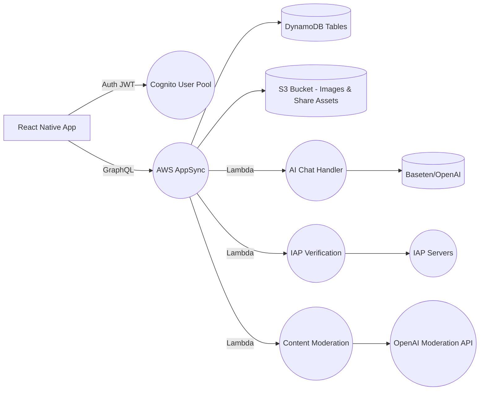

# HNNT / HINTO – Backend MVP Guide

*Companion to the PRD (v2025-05-12).  Audience: Serverless backend engineers.*
*Last updated: 2025-05-21*

---

## 1  Core Principles

1. **Serverless-first** – leverage AWS managed services (Amplify/AppSync, DynamoDB, Lambda).
2. **Security & Privacy** – JWT auth via Cognito; fine-grained GraphQL @auth rules; minimal PII.
3. **Scalability & Low-latency** – DynamoDB single-table patterns; GraphQL subscriptions for real-time.
4. **Maintainability** – IaC via Amplify CLI; clear folder layout; atomic CloudFormation resources.

---

## 2  Architecture Overview



*Data flows: client ↔ GraphQL API ↔ datastore/functions ↔ external services.*

**Current Deployment:**
- GraphQL Endpoint: https://4b5xcv6m6vendkjb2skswpao6u.appsync-api.us-west-2.amazonaws.com/graphql
- Region: us-west-2
- Environment: dev
- Transformer Version: 2

---

## 3  AWS Resources & Services

| Resource                         | Purpose                                                   | Status |
| -------------------------------- | --------------------------------------------------------- | ------ |
| **Cognito User Pool**            | OAuth federation: Snapchat, TikTok, Google; JWT issuance. | ✅     |
| **AppSync GraphQL API**          | Single endpoint for queries, mutations, subscriptions.    | ✅     |
| **DynamoDB**                     | Stores Users, Situationships, Votes, Reports.             | 🔄     |
| **S3 Bucket**                    | Stores shareable PNGs & optional avatar images (via PC).  | ✅     |
| **Lambda Functions**             | AI Chat proxy, Payment verification, Content moderation.  | 🔄     |
| **CloudWatch Logs**              | Lambda & AppSync resolver logs; metrics & alarms.         | ✅     |
| **IAM Roles & Policies**         | Least-privilege access for functions, AppSync, S3.        | ✅     |
| **Amplify CLI / CloudFormation** | IaC definitions for all above.                            | ✅     |

**Legend:** ✅ Deployed, 🔄 In Progress, [ ] Pending

**Known Issues:**
- Field-level authorization warnings for User, Situationship, and InviteToken models
  - Models affected: User (owner), Situationship (owner), InviteToken (ownerId)
  - Action required: Review and implement field-level authorization rules
  - Reference: https://docs.amplify.aws/cli/graphql/authorization-rules/#per-user--owner-based-data-access

---

## 4  Directory & File Structure

```
backend/
  amplify/
    # auto-generated by Amplify CLI
  graphql/
    schema.graphql           # Defines types, queries, mutations, subscriptions
    resolvers/               # Custom VTL or pipeline resolvers if needed
  functions/
    chatHandler/
      src/index.js           # Lambda to proxy AI chat
      package.json
      event.json             # sample event for testing
    paymentVerifier/
      src/index.js           # Lambda to verify IAP receipts
      package.json
    moderationHook/
      src/index.js           # Lambda to call OpenAI Moderation API
      package.json
  iam-policies/              # Custom IAM policy JSONs if required
  cfn-templates/             # Additional CloudFormation snippets
  scripts/
    deploy.sh                # CI deploy helper
  README.md                  # Backend setup & amplify commands
```

---

## 5  GraphQL Schema (schema.graphql)

```graphql
# Auth directives enforce owner-based and group-based access
# See @auth in AWS Amplify docs
# Models:
#   User, Situationship, Vote, FeedbackComment, Invite, Report

type User @model @auth(rules: [
  { allow: owner },
  { allow: private, provider: iam }
]) {
  id: ID!
  username: String!
  avatarUrl: String
  isPrivate: Boolean!
  mutualsOnly: Boolean!
  plan: SubscriptionPlan
  createdAt: AWSDateTime!
}

enum SubscriptionPlan { FREE PRO }

type Situationship @model @auth(rules: [
  { allow: owner },
  { allow: groups, groupsField: "sharedWith", operations: [read] }
]) {
  id: ID!
  owner: String!                # Cognito userId
  name: String!
  emoji: String
  category: String
  rankIndex: Int
  sharedWith: [String]          # friend userIds
  createdAt: AWSDateTime!
}

type Vote @model @auth(rules: [
  { allow: owner, ownerField: "voterId", operations: [create] },
  { allow: owner, ownerField: "targetUserId", operations: [read] }
]) {
  id: ID!
  voterId: String!
  targetUserId: String!
  bestId: ID!
  worstId: ID!
  comment: String
  createdAt: AWSDateTime!
}

type Report @model @auth(rules: [
  { allow: private, provider: iam }
]) {
  id: ID!
  reporter: String
  contentId: ID!
  reason: String!
  createdAt: AWSDateTime!
}

type InviteToken @model @auth(rules: [
  { allow: owner, ownerField: "ownerId" }
]) {
  id: ID!
  ownerId: String!
  token: String!
  expiresAt: AWSDateTime!
}

# Queries & Mutations autogenerated by @model
# Subscriptions: onCreateVote, onUpdateSituationship, etc.
```

*Use Amplify CLI `amplify add api` to push this schema.*

---

## 6  API Operations & Auth Rules

| Operation             | Type         | Input / Output    | Auth               |
| --------------------- | ------------ | ----------------- | ------------------ |
| `getUser(id)`         | Query        | `User`            | owner              |
| `listUsers`           | Query        | `[User]`          | IAM (admin)        |
| `createSituationship` | Mutation     | `Situationship`   | owner              |
| `updateSituationship` | Mutation     | `Situationship`   | owner              |
| `deleteSituationship` | Mutation     | `Situationship`   | owner              |
| `listSituationships`  | Query        | `[Situationship]` | owner              |
| `generateInviteToken` | Mutation     | `InviteToken`     | owner              |
| `createVote`          | Mutation     | `Vote`            | ANY authenticated  |
| `listVotesByTarget`   | Query        | `[Vote]`          | targetUserId owner |
| `