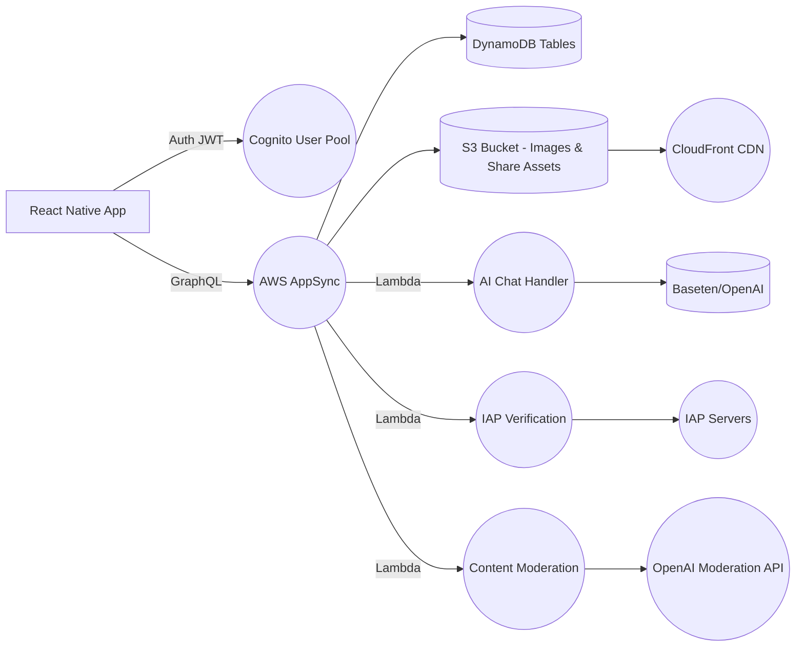

# HNNT / HINTO – Backend Architecture & Design Guide

*Companion to the PRD (v2025-05-12). Audience: Backend Engineers & Architects.*
*Last updated: 2025-05-21*

---

## 1 Core Principles

1. **Serverless-first** – Leverage AWS managed services (Amplify/AppSync, DynamoDB, Lambda) for scalability and reduced operational overhead.
2. **Security & Privacy** – JWT auth via Cognito; fine-grained GraphQL @auth rules; minimal PII storage; secure OAuth flows.
3. **Scalability & Low-latency** – DynamoDB single-table patterns; GraphQL subscriptions for real-time; CDN for static assets.
4. **Maintainability** – IaC via Amplify CLI; clear folder layout; atomic CloudFormation resources; comprehensive logging.
5. **Cost Efficiency** – Pay-per-use model; optimized AI model usage; caching strategies for common operations.

---

## 2 Architecture Overview



*Data flows: client ↔ GraphQL API ↔ datastore/functions ↔ external services.*

**Current Deployment:**
- GraphQL Endpoint: https://4b5xcv6m6vendkjb2skswpao6u.appsync-api.us-west-2.amazonaws.com/graphql
- Region: us-west-2
- Environment: dev
- Transformer Version: 2

---

## 3 AWS Resources & Services

| Resource                         | Purpose                                                   | Status | Notes |
| -------------------------------- | --------------------------------------------------------- | ------ | ----- |
| **Cognito User Pool**            | OAuth federation: Snapchat, TikTok, Google; JWT issuance. | ✅     | Handles social login flows and user attributes |
| **AppSync GraphQL API**          | Single endpoint for queries, mutations, subscriptions.    | ✅     | Includes real-time subscriptions for votes/updates |
| **DynamoDB**                     | Stores Users, Situationships, Votes, Reports.             | 🔄     | Using single-table design patterns |
| **S3 Bucket**                    | Stores shareable PNGs & optional avatar images.           | ✅     | Behind CloudFront CDN for global delivery |
| **Lambda Functions**             | AI Chat proxy, Payment verification, Content moderation.  | 🔄     | Includes streaming support for AI responses |
| **CloudWatch Logs**              | Lambda & AppSync resolver logs; metrics & alarms.         | ✅     | Includes custom metrics for AI usage |
| **IAM Roles & Policies**         | Least-privilege access for functions, AppSync, S3.        | ✅     | Regularly audited for security |
| **Amplify CLI / CloudFormation** | IaC definitions for all above.                            | ✅     | Includes custom resource definitions |
| **CloudFront CDN**              | Global content delivery for static assets.                | ✅     | Optimized for image delivery |

**Legend:** ✅ Deployed, 🔄 In Progress, [ ] Pending

**Known Issues:**
- Field-level authorization warnings for User, Situationship, and InviteToken models
  - Models affected: User (owner), Situationship (owner), InviteToken (ownerId)
  - Action required: Review and implement field-level authorization rules
  - Reference: https://docs.amplify.aws/cli/graphql/authorization-rules/#per-user--owner-based-data-access

---

## 4 Directory & File Structure

```
backend/
  amplify/
    # auto-generated by Amplify CLI
  graphql/
    schema.graphql           # Defines types, queries, mutations, subscriptions
    resolvers/               # Custom VTL or pipeline resolvers if needed
  functions/
    chatHandler/
      src/index.js           # Lambda to proxy AI chat with streaming
      package.json
      event.json             # sample event for testing
    paymentVerifier/
      src/index.js           # Lambda to verify IAP receipts
      package.json
    moderationHook/
      src/index.js           # Lambda to call OpenAI Moderation API
      package.json
  iam-policies/              # Custom IAM policy JSONs
  cfn-templates/             # Additional CloudFormation snippets
  scripts/
    deploy.sh                # CI deploy helper
    analytics.sh             # Log analysis tools
  README.md                  # Backend setup & amplify commands
```

---

## 5 GraphQL Schema & API Design

### 5.1 Core Schema

```graphql
# Auth directives enforce owner-based and group-based access
# See @auth in AWS Amplify docs

type User @model @auth(rules: [
  { allow: owner },
  { allow: private, provider: iam }
]) {
  id: ID!
  username: String!
  avatarUrl: String
  isPrivate: Boolean!
  mutualsOnly: Boolean!
  plan: SubscriptionPlan
  createdAt: AWSDateTime!
  # Additional fields from social logins
  snapchatId: String
  tiktokId: String
  googleId: String
}

enum SubscriptionPlan { FREE PRO }

type Situationship @model @auth(rules: [
  { allow: owner },
  { allow: groups, groupsField: "sharedWith", operations: [read] }
]) {
  id: ID!
  owner: String!                # Cognito userId
  name: String!
  emoji: String
  category: String
  rankIndex: Int
  sharedWith: [String]          # friend userIds
  createdAt: AWSDateTime!
  # Analytics fields
  voteCount: Int
  lastVotedAt: AWSDateTime
}

type Vote @model @auth(rules: [
  { allow: owner, ownerField: "voterId", operations: [create] },
  { allow: owner, ownerField: "targetUserId", operations: [read] }
]) {
  id: ID!
  voterId: String!
  targetUserId: String!
  bestId: ID!
  worstId: ID!
  comment: String
  createdAt: AWSDateTime!
  isAnonymous: Boolean
}

type Report @model @auth(rules: [
  { allow: private, provider: iam }
]) {
  id: ID!
  reporter: String
  contentId: ID!
  reason: String!
  status: ReportStatus
  createdAt: AWSDateTime!
}

enum ReportStatus { PENDING REVIEWED RESOLVED }

type InviteToken @model @auth(rules: [
  { allow: owner, ownerField: "ownerId" }
]) {
  id: ID!
  ownerId: String!
  token: String!
  expiresAt: AWSDateTime!
  usedAt: AWSDateTime
}

# Queries & Mutations autogenerated by @model
# Subscriptions: onCreateVote, onUpdateSituationship, etc.
```

### 5.2 Key API Operations

| Operation             | Type         | Input / Output    | Auth               | Notes |
| --------------------- | ------------ | ----------------- | ------------------ | ----- |
| `getUser(id)`         | Query        | `User`            | owner              | Includes social IDs if available |
| `listUsers`           | Query        | `[User]`          | IAM (admin)        | Paginated with filters |
| `createSituationship` | Mutation     | `Situationship`   | owner              | Validates category |
| `updateSituationship` | Mutation     | `Situationship`   | owner              | Handles reordering |
| `deleteSituationship` | Mutation     | `Situationship`   | owner              | Cascades to votes |
| `listSituationships`  | Query        | `[Situationship]` | owner/shared       | Includes vote counts |
| `generateInviteToken` | Mutation     | `InviteToken`     | owner              | 24h expiration |
| `createVote`          | Mutation     | `Vote`            | ANY authenticated  | Respects anonymity |
| `listVotesByTarget`   | Query        | `[Vote]`          | targetUserId owner | Filtered by date |

---

## 6 External Service Integration

### 6.1 AI Chat Service
- **Provider**: Baseten (primary) with OpenAI fallback
- **Models**: GPT-4 (complex queries), GPT-3.5 (simple queries)
- **Features**:
  - Streaming responses for better UX
  - Context-aware conversations
  - Content moderation integration
  - Rate limiting and usage tracking
- **Implementation**: Lambda function with WebSocket support

### 6.2 Payment Processing
- **Providers**: Apple IAP, Google Play Billing
- **Verification**: Server-side receipt validation
- **Features**:
  - Subscription management
  - One-time purchase support
  - Usage tracking
  - Refund handling

### 6.3 Content Moderation
- **Provider**: OpenAI Moderation API
- **Features**:
  - Real-time content screening
  - Report handling
  - Automated action triggers
  - Admin review queue

---

## 7 Performance & Optimization

### 7.1 Latency Optimization
- GraphQL field-level selection
- DynamoDB single-table design
- CloudFront CDN for static assets
- Lambda cold start mitigation
- Connection pooling for external APIs

### 7.2 Scaling Considerations
- DynamoDB auto-scaling
- Lambda concurrency limits
- AppSync subscription quotas
- AI model request queuing
- CDN cache strategies

### 7.3 Monitoring & Analytics
- CloudWatch metrics and alarms
- Custom business metrics
- User engagement tracking
- AI usage analytics
- Cost optimization metrics

---

## 8 Security & Compliance

### 8.1 Authentication
- JWT-based auth via Cognito
- Social login integration
- MFA support
- Session management

### 8.2 Authorization
- Field-level GraphQL auth
- IAM role-based access
- Resource-based policies
- API key rotation

### 8.3 Data Protection
- Minimal PII storage
- Encrypted data at rest
- Secure data in transit
- Regular security audits

---

## 9 Development & Deployment

### 9.1 Local Development
- Amplify CLI for local testing
- DynamoDB Local
- Lambda function testing
- GraphQL schema validation

### 9.2 CI/CD Pipeline
- GitHub Actions integration
- Automated testing
- Staging deployment
- Production safeguards

### 9.3 Backup & Recovery
- DynamoDB point-in-time recovery
- S3 versioning
- Cross-region replication
- Disaster recovery plan

---

*For implementation details, refer to the specific service documentation and the Amplify CLI guides.*